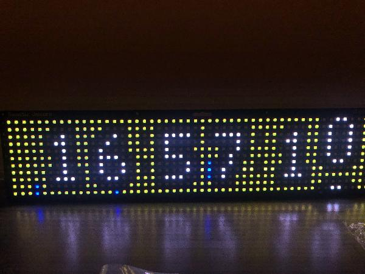

# Galactic Unicorn Retro Rotary Clock with Temperature, Wind and Rain from Ecowitt API

This python program will display the time (in 24 hours, with seconds) with an animated "rotary" style like very early "digital" clocks.  Using the oxymoron: "An analogue digital clock".

It was inspired by the demo [clock](https://github.com/pimoroni/pimoroni-pico/blob/main/micropython/examples/galactic_unicorn/clock.py) program provided by Pimoroni.  In fact you can still use it this way by changing the mode.  Code is provided under the MIT License.

## Features

1. Animated 24hr "digital" clock in the very old format where the digits were mechanically driven.
2. Background colour based on Temperature from your weather station (default).
3. Background shows "rain" (falling blue lines) of various length and frequency based on rain rate.
4. Background shows "wind" from the left like a "wind sock" by shifting hue/saturation of the background.
5. Original "colour distance from midnight/midday" of the original demo program.  No weather animations.
6. Will turn off at 23:00 and turn on at 6:00 (you can change these in the program).

With features like these, this will become your defacto Galactic Unicorn program!



### Operation

- The volume button (up/down) will set the hour offset (as the clock will get its time from an NTP server in UTC).  Note there is also a variable `utc_offset` which you can set - so if you don't do daylight savings, set that variable and you're done.
- The "A" button will resynchronise the time to an NTP server.  You should push this occasionally as the clock will drift.  
- The "B" button will set background to "colour of the day" provided by Pimoroni.
- The "C" button will set background to "outside temperature colour" with wind and rain animations.
- The "D" button will toggle the display on or off (note it has a display timer which will toggle them back when applicable, and this will revert back if you use the button during the hour the display was set on or off.  Yea, its a "feature").
- Brightness controls will adjust display's brightness...who'd have thunk that??


## Setup

To use it, you must setup your wifi as described in the comments on the program, and then set the URL for your Ecowitt (or compatible) API.  

If you have not setup an Ecowitt API for your weather station, here is a [rough guide](../readme.md#ecowitt-api).  This also shows the [JSON format](../readme.md#json-format) if you prefer to use a custom web server and want it to return a compatible format.  You can also change the function `def set_weather_data(data):` if you have a different JSON format you would like to use.

In the [main.py](../../galacticUnicorn/main.py) set the `URL` variable with your API application id, api key, and MAC information.  You will also need the other paramters as they are to get the right units the programs expect.

```python
# URL to get the data from.  Data must be returned in Ecowitt format.
URL="https://api.ecowitt.net/api/v3/device/real_time?application_key=<your_application_key>&api_key=<your_api_key>&mac=<your_station_mac_address>&call_back=all&temp_unitid=1&pressure_unitid=3&wind_speed_unitid=6&rainfall_unitid=12"
```

Please note I no longer use Ecowitt's API directly.  But when I did, the `call_back=all` parameter sometimes crashed the 2040 due to memory.  I may have cleaned up the leak, but if you have problems, consult the Ecowitt API to see if you can use this parameter to return only the three values you need.

As Ecowitt is a public API, you will have limits on call frequencies, so set the refresh rate to something "safe" such as 10min.

```python
# Set this to how often you'll refresh data from the API in seconds
UPDATE_INTERVAL = 600
```
Lastly, the clock is set to turn the display on or off at set times (0600 and 2300 respectively).  Set these as follows in the code.

```python
def redraw_display_if_reqd():
    global year, month, day, wd, hour, minute, second, last_second, last_milli
    
    # To disable the auto on/off, just set these both to 25 or larger.
    TURN_ON_AT=6
    TURN_OFF_AT=23
```
## Technical notes

For further details on the JSON format used by the program (Ecowitt format) check out the [rough guide](../readme.md#json-format).

### Calibration

Similar to the Plasma, this has been calibrated to my climate, and metric units.

#### Temperature
**Units:** Degrees Celcius.

**Calibration:**  The temperature is calibrated to my climate, which is 0-50 degrees celcius.  Anything below or above is set to these limits.  You'll need to recalibrate the colour scale (possibly using purple if you live in Siberia or Manitoba and tempertures go below -40 degrees).  The code uses HSV and "Colour temperature" will play nice with temperature.  Start at purple for the lowest it and will move through the scale to red for your highest.

If you prefer Kelvin, adjust accordingly. I've heard rumors of some group of luddites who use some silly temperature measurement from the 1800s, possibly earlier.  If you are one of those, I'm sure you learned how to convert to Standard Scientific Units (SI) at school.  So use that conversion or crib one from the interwebs.

#### Wind
**Units:** m/s (metres per second)

**Calibration:** Wind has been calibrated from `0` to `20.7m/s`.

You may want to adjust this if you get more or less wind, as the speed of the wind does decide how far the effect will travel. 

#### Rain
**Units:** mm/h (millimetres per hour)

**Calibration:** Rain is calibrated from `0` to `100mm/h`.

You can adjust the rain extremes, but quite frankly, at the top value the thing gets so noisy its doubtful to be noticed.

## Hacking Tips

Hope the code makes enough sense and has enough comments for anyone with good python experience to work out.  As this "works for me", and is provided free, please don't expect me to support you if you struggle.  I will welcome improvements/pull requests.

The background is rendered by the function `def redraw_display_if_reqd():`  In it, you will see calls to the different backgrounds based on your selection: `gradient_background()` or `weather_background()`.

It's been a while since I wrote this, so I don't remember exactly how I animated the wind.  I had to "taper off" the wave at it travelled accross the screen.  As this display is pretty low res, the math is linear.  How far the wave travels is based on the wind's speed.  The frequency of a wave will also be based on wind speed (as its a probability).  

The rain used the rain rate and a probablity based on it to determine if a rain drop should form.  The rain rate would also determine how big the "drop" is (2-4 pixels).  Again, the bigger rain rate, the higher probability of rain and a larger rain drop.  It kept record of where the drop was so that a new drop would only form if the existing drop is in at least the third pixel from top of the column.  This ensures a one pixel gap between drops, at least vertically.  Horizontally, drops can appear side-by-side.

The wind layer is applied first, then the rain, and last the clock.  Thus rain is visible in front of wind, and the clock numbers are never obstructed by either.

Good luck.  The animation code is likely messy as I have not visited this for a while and I'm not sure if its very elegant or properly commented.

